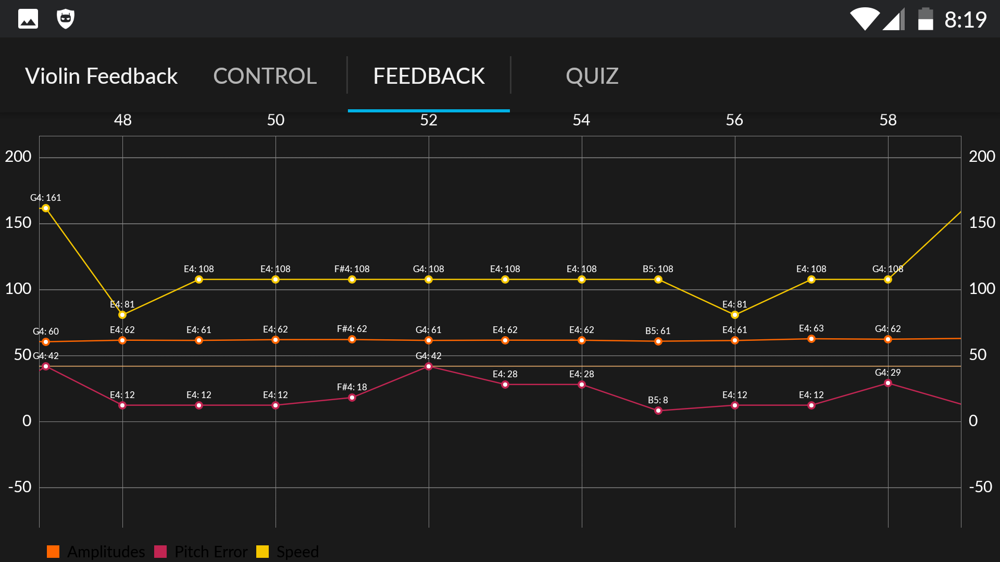
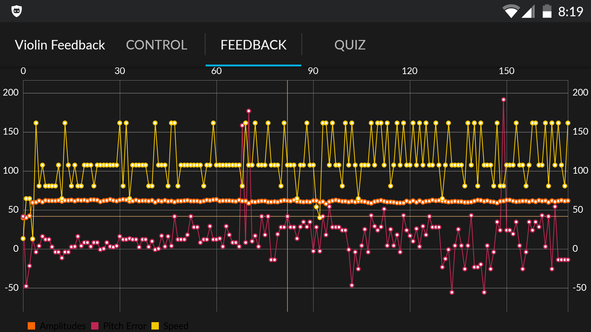

# Violin Feedback

A small tool which analysis the sound of a single instrument and calculates some basic metrics (loudness, pitch, speed). Metrics can provide some useful feedback to a user. It is however mandatory to understand how it works otherwise the metrics might make not much sense or might be misunderstood.

## Metrics
The feedback tab is a graph with tree traces: One for amplitude/loudness, pitch error and speed. As can been seen the accuracy of the metrics isn't very high. It's however visible already that the 2nd half of the song was played faster and the pitch was pretty wrong too.

If you zoom in then the data points will be annotated with the note name.

## Algorithm
The underlying algorithm is very basic.
While recording do the following:
1. Obtain sound samples of about a 1/8th of a second (frame length)
2. Calculate spectrum of the frame (using a FFT)
3. Find the maximum magnitude, the position of the maximum gives us the frequency and the amplitude the loudness

As soon as the recording is finished:
4. Find peaks in the amplitude data obtained earlier
5. Assuming that every peak is a note, remove all amplitude and frequency values which are not at a peak
6. The delta between the position of of adjacent peaks gives us the speed

## Build
`sbt android:install` with a connected Android device